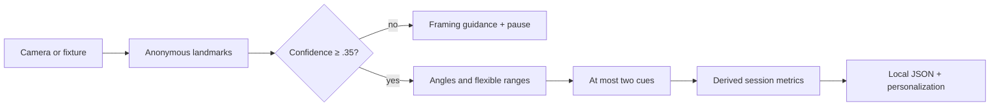

# Architecture

## Components

Saha uses ports between capture, landmark inference, analysis, coaching, routines, and storage. `LandmarkSource` is the only input the analysis pipeline needs, and two implementations exist: `DemoLandmarkSource` supplies deterministic synthetic coordinates when no model is on disk, and `CameraLandmarkSource` supplies real ones.

The live path runs entirely on one capture thread: `OpenCvCameraCapture` reads frames, `PoseEstimator` runs MoveNet SinglePose Lightning through ONNX Runtime on each, and `LandmarkSmoother` steadies the result before the interface reads it. The model is shown a square patch cropped to the person — chosen by `PersonCrop` from the previous frame's keypoints, falling back to the whole frame until a body is found — rather than the whole letterboxed frame, which starved a standing body down to about 144 of the input's 192 pixels. The JavaFX side only ever reads the most recent completed frame and coalesces preview updates, so a slow inference can never stall the practice timer or flood the event queue.

Capture and inference run on a dedicated **platform** thread, on purpose: every call in that loop is a blocking native call, which would pin a virtual thread's carrier for the whole practice. The speech helper's reader and writer are where virtual threads belong, and are (`SystemVoice`).

`PoseAnalyzer` first finds the minimum confidence of every required landmark. Below 0.35 it returns the sealed `Unreliable` result, which contains framing guidance but cannot contain corrective suggestions. Reliable frames evaluate 2D joint angles against pose-specific ranges. Rules are prioritized and capped at two. Timing consumes only reliable frames.

`RoutineGenerator` creates the beginner sequence. `PersonalizationEngine` consumes derived `SessionMetric` records and produces duration deltas plus user-facing reasons. `JsonSessionStore` is the only persistent component.

## Data flow

## Java platform choices

Gradle targets Java 26. Records express immutable domain values; sealed results and exhaustive switch patterns make reliability branching explicit; collection factories minimize mutable shared state. The pose catalog is a Java 26 preview `LazyConstant`, built exactly once on first use, and the model file is read through a memory-mapped `MemorySegment` in a confined `Arena`. JavaFX provides an accessible native desktop surface and scheduled UI timing. Blocking native work (capture, inference) lives on a platform thread; blocking I/O that only waits (speech reader/writer) lives on virtual threads; results are marshalled back to the JavaFX thread.

## Dependencies and licenses

| Component | Pinned version | License | Purpose/status |
|---|---:|---|---|
| Gradle | 9.4.0 | Apache-2.0 | Java 26-capable wrapper |
| OpenJFX | 26 | GPLv2 + Classpath Exception | UI |
| ONNX Runtime | 1.22.0 | MIT | Local inference runtime |
| OpenPnP OpenCV | 4.9.0-0 | BSD-3-Clause | Camera capture and the image work around inference |
| Jackson | 2.19.2 | Apache-2.0 | Derived-metric JSON |
| JUnit | 5.13.4 | EPL-2.0 | Tests |

## Compatibility decision

The application builds and tests with Temurin 26.0.1 through the pinned Gradle 9.4.0 wrapper. The model is not bundled: `scripts/fetch-model.ps1` downloads it and refuses a file whose SHA-256 does not match the pin, and the estimator reads the input tensor's declared shape and dtype from the model rather than assuming them. Without the model on disk the app says so and falls back to demo mode, which keeps all non-capture behavior functional; with it, live inference drives the same analysis pipeline the demo does. See [the model card](model-card.md) for what the model is and how far it has been validated.

## Logging

Application logs must contain lifecycle/error identifiers and aggregate timing only. Never log frames, images, coordinates, profile free text, or detailed body measurements.
